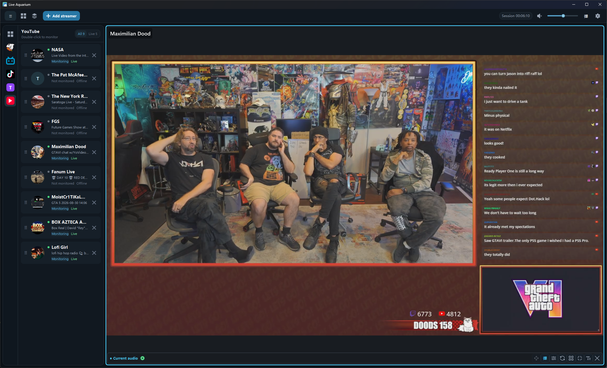

[简体中文](README.md) | [English](README.en-US.md)

<div align="center">
  
  <h1>Live Aquarium</h1>
  <p><strong>See multiple live rooms clearly in one window.</strong></p>
  <p>Windows 10 / 11 · Up to 16 rooms · No platform sign-in required</p>
  <p>
    <a href="https://github.com/maofanyi/LiveAquarium-Releases/releases/latest"><strong>Download latest</strong></a>
    · <a href="https://maofanyi.github.io/LiveAquarium-Releases/">Illustrated guide</a>
    · <a href="#community-and-support">Community and feedback</a>
  </p>
</div>



Live Aquarium is a multi-platform live-stream monitoring app for Windows. It brings public rooms from Douyu, Bilibili, Douyin, Huya, Twitch, and YouTube into one workspace for following multiple streamers, tournaments, or live events at the same time.

> This is the official release repository for Live Aquarium. It contains installers, user documentation, and release verification data. The application source code is not published here.

## Highlights

| Multi-platform | Flexible layouts | Independent audio |
| --- | --- | --- |
| Paste a room URL to detect its platform and monitor up to 16 rooms | Use 1×1 through 4×4 layouts, a ready-to-fill 2×2 layout, drag-and-drop, and resizing | Use one audio focus or Shift-select multiple rooms, with independent volume and boost controls |
| **Live danmaku** | **Instant replay** | **Local-first** |
| Global and per-room controls with Compact, Normal, and Max display strategies | Keep roughly the latest 120 seconds and export GIF or MP4 with audio | Room lists, layouts, and preferences stay local; platform accounts and cookies are not stored |

Also included: in-window and true fullscreen, video zoom and pan, live-status notifications, audience metrics, viewing-break reminders, custom groups, and multiple saved monitoring presets.

## Download and Install

Current version: **1.10.1**

| Channel | Installer | Notes |
| --- | --- | --- |
| [GitHub Releases](https://github.com/maofanyi/LiveAquarium-Releases/releases/latest) | `LiveAquarium-Setup-1.10.1.exe` | Full installer; recommended |
| [Gitee Releases](https://gitee.com/ntrmao/DouyuMonitor-Releases/releases) | `LiveAquarium-Setup-1.10.1-Lite.exe` | Lite installer; downloads and verifies `yt-dlp` when YouTube or Twitch is first used |

Requires 64-bit Windows 10 or Windows 11. A GPU with D3D11VA support and a current stable driver is recommended. Multiple simultaneous streams consume GPU, CPU, memory, and network bandwidth.

<details>
<summary><strong>Installer verification and Windows security notice</strong></summary>

The app does not currently have an Authenticode signature, so Windows may show an “Unknown publisher” warning on first launch. Download only from the official release pages above and verify SHA-256 when needed:

```powershell
Get-FileHash -Algorithm SHA256 '.\LiveAquarium-Setup-1.10.1.exe'
```

GitHub full installer:

```text
5e95bfcba1dc51ac9aef704f33cc2af6f0d969542ac6b7bf13cdab13483608b6
```

Gitee lite installer:

```text
2835997dbb07ca4ad1dffde5a0549b6cc5a4da25525b31ac4461d8208ee1864a
```

</details>

## Get Started in Three Steps

1. Select **Add Streamer** and paste a supported live-room URL.
2. Choose or adjust a layout, then drag streamers into place.
3. Click a tile to switch audio focus; hold Shift to select multiple audio rooms.

- [Illustrated online guide](https://maofanyi.github.io/LiveAquarium-Releases/)
- [Chinese text guide](docs/使用说明.md)
- [Illustrated offline guide](docs/user-guide-english.html) — download the repository and open it in a browser

The onboarding guide and keyboard shortcuts are also available under **Settings → Help**.

## Community and Support

<table>
  <tr>
    <td align="center" width="240">
      <strong>Official community and feedback</strong><br><br>
      <br><br>
      QQ group: <code>796651138</code><br>
      Share feedback, report issues, or suggest improvements
    </td>
    <td align="center" width="240">
      <strong>Support the author</strong><br><br>
      <br><br>
      Voluntary support only<br>
      No app features or commercial license are attached
    </td>
  </tr>
</table>

When reporting an issue, include the app version, reproduction steps, and a diagnostics summary you have reviewed. Do not publish accounts, passwords, cookies, verification codes, complete logs, or other personal information.

## Data and Privacy

<details>
<summary><strong>Local data, anonymous statistics, and replay-cache details</strong></summary>

- Settings are stored in `%LocalAppData%\DouyuMonitor\settings.json`.
- Logs are stored in `%LocalAppData%\DouyuMonitor\logs\monitor-YYYYMMDD.log`.
- Anonymous statistics use a randomly generated installation ID and send one daily summary of usage time, platform and layout features, and the country/region code from Windows regional settings. Unsent data is retained locally for up to 14 days.
- Ordinary errors remain aggregated locally. At most one clearly fatal error is sent automatically per installation per day, and users can explicitly send a redacted report from Diagnostics. Sentry may infer country/region from the connection source IP, but the app does not put the IP into telemetry fields.
- Room IDs, streamer names, live titles, stream URLs, danmaku, Windows usernames, hardware identifiers, full local paths, complete settings, and complete logs are not sent.
- Each playing room keeps roughly the latest 120 seconds of bounded compressed audio/video in process memory for local replay. The cache is never uploaded and is released when the app exits.
- Only preview and export create bounded temporary media files, which are cleaned afterward. GIF/MP4 output defaults to the app's `Highlights` folder and can be changed in Settings.
- Uninstalling does not automatically remove settings, logs, or exported media.

</details>

Do not repackage the installer, present modified builds as official, or distribute unofficial installers under the project name or icon without permission.
