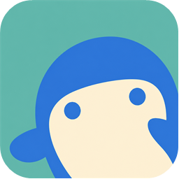

# 直播水族馆

[简体中文](README.md) | [English](README.en-US.md)



> 多平台直播监看

面向 Windows 10/11 x64 的多房间直播监看工具。单个窗口最多同时监控 16 个无需登录即可访问的公开直播间，适合同时关注多个主播、赛事或活动现场。

当前版本支持斗鱼、Bilibili、抖音、虎牙、Twitch 和 YouTube。

> 本仓库是直播水族馆的官方发行仓库，只提供安装程序、使用说明和版本校验信息，不公开项目源码。

## 下载

请从 [Releases](https://github.com/maofanyi/LiveAquarium-Releases/releases/latest) 下载最新的 `LiveAquarium-Setup-1.8.0.exe`。

当前版本：**1.8.0**

仅应信任本仓库发布的安装程序。软件目前没有 Authenticode 代码签名，Windows 首次运行时可能显示未知发布者；请在运行前核对 SHA-256。

```powershell
Get-FileHash -Algorithm SHA256 '.\LiveAquarium-Setup-1.8.0.exe'
```

安装包 SHA-256：

```text
05c556f684e0d2c73b14383ffdb1d20dcfd165eaba9772e43c1c044c32407ec7
```

## 主要功能

- 最多同时监控 16 个公开直播间，粘贴链接后自动识别支持的平台。
- 自由拖动、交换和调整监控画面尺寸，保存多套监控方案。
- 支持单路音频焦点以及 Shift 多选的多路音频模式。
- 支持实时弹幕、全局与单房间开关，以及精简、普通和 Max 智能显示策略。
- 支持贵宾人数常驻显示、短时间暴涨提醒和观看休息提醒。
- 使用 FFmpeg、D3D11VA 和 WPF D3DImage，安装包自带所需 .NET 与 FFmpeg 运行库。
- 房间列表、布局、音量和窗口状态保存在本机，不保存平台账号、Cookie 或密码。

## 使用说明

- [在线图解使用说明](https://maofanyi.github.io/LiveAquarium-Releases/)
- [文字使用说明](docs/使用说明.md)
- [离线图解使用说明](docs/user-guide.html)（下载后使用浏览器打开）

应用内也可以从“设置 → 使用说明”打开同一份图解文档。

## 系统要求

- Windows 10 或 Windows 11，64 位。
- 推荐使用支持 D3D11VA 的显卡和最新稳定驱动。
- 同时播放多路直播会消耗 GPU、CPU、内存和网络带宽，请根据设备性能调整监控数量。

## 数据与隐私

- 设置：`%LocalAppData%\DouyuMonitor\settings.json`
- 日志：`%LocalAppData%\DouyuMonitor\logs\monitor-YYYYMMDD.log`
- 匿名统计：软件使用随机生成并持久化的安装标识，每天一次发送使用时长、平台与布局功能汇总及 Windows 区域设置对应的两位国家/地区代码。普通错误仅在本地聚合；明确致命错误每安装每天最多自动发送一条，用户也可在诊断窗口主动发送最多 5 个脱敏聚合错误。
- Sentry 可保存遥测请求的连接来源 IP，并据此提供国家/地区信息；应用不会把 IP 放入遥测字段，也不发送房间号、主播名称、直播标题、直播地址、弹幕、Windows 用户名、硬件标识、完整本地路径、完整设置或完整日志。
- 未发送统计最多在本地保留 14 天；清除本地应用数据会同时重置匿名安装标识。
- 卸载不会自动删除上述本地数据。
- 软件不保存平台账号、Cookie 或密码。

## 问题反馈与安全提示

反馈问题时请提供软件版本、复现步骤和已人工检查的诊断日志，不要公开包含个人信息或访问凭据的内容。

未经允许，请勿重新打包、修改后冒充官方版本，或使用本项目名称和图标分发非官方安装程序。

## 支持作者

如果这个工具对你有帮助，可以自愿通过支付宝支持作者。赞助不会影响软件功能，也不代表购买商业授权。


