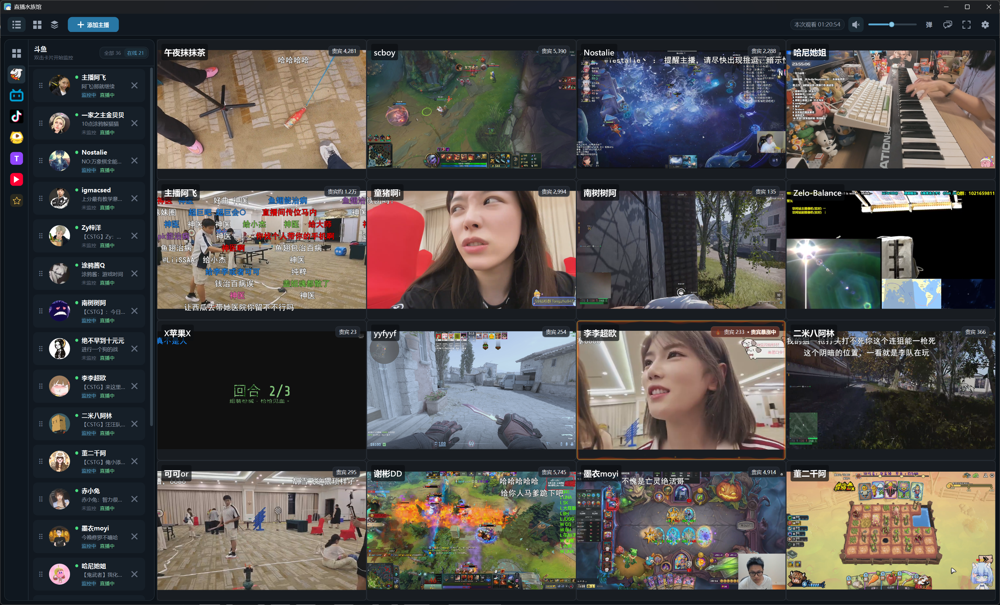

[简体中文](README.md) | [English](README.en-US.md)

<div align="center">
  
  <h1>直播水族馆</h1>
  <p><strong>在一个窗口里，同时看懂多个直播间。</strong></p>
  <p>Windows 10 / 11 · 最多 16 路 · 无需登录平台账号</p>
  <p>
    <a href="https://github.com/maofanyi/LiveAquarium-Releases/releases/latest"><strong>下载最新版</strong></a>
    · <a href="https://maofanyi.github.io/LiveAquarium-Releases/">图解使用说明</a>
    · <a href="#交流与支持">交流与反馈</a>
  </p>
</div>



直播水族馆是一款面向 Windows 的多平台直播监看工具。把斗鱼、Bilibili、抖音、虎牙、Twitch 和 YouTube 的公开直播间集中到同一个工作区，适合同时关注多个主播、赛事或活动现场。

> 本仓库是直播水族馆的官方发行仓库，只提供安装程序、使用说明和版本校验信息，不公开项目源码。

## 核心能力

| 多平台聚合 | 灵活布局 | 独立音频 |
| --- | --- | --- |
| 粘贴直播间链接即可识别平台，最多同时监控 16 路 | 支持 1×1 至 4×4、可直接拖入房间的 2×2 默认布局、自由拖动与缩放 | 单路音频焦点或 Shift 多选，多房间独立音量与音量增强 |
| **实时弹幕** | **精彩回溯** | **本地优先** |
| 全局及单房间开关，支持精简、普通和 Max 智能显示策略 | 保留最近约 120 秒，可导出 GIF 或带声音 MP4 | 房间、布局和偏好保存在本机，不保存平台账号或 Cookie |

此外还支持窗口全屏、系统全屏、视频缩放与平移、直播状态提醒、贵宾人数显示、观看休息提醒、自定义分组和多套监控方案。

## 下载与安装

当前版本：**1.10.0**

| 渠道 | 安装包 | 说明 |
| --- | --- | --- |
| [GitHub Releases](https://github.com/maofanyi/LiveAquarium-Releases/releases/latest) | `LiveAquarium-Setup-1.10.0.exe` | 完整版，推荐 |
| [Gitee Releases](https://gitee.com/ntrmao/DouyuMonitor-Releases/releases) | `LiveAquarium-Setup-1.10.0-Lite.exe` | 轻量版；首次使用 YouTube 或 Twitch 时下载并校验 `yt-dlp` |

系统要求：Windows 10 或 Windows 11，64 位。推荐使用支持 D3D11VA 的显卡和最新稳定驱动；同时播放多路直播会消耗 GPU、CPU、内存和网络带宽。

<details>
<summary><strong>安装包校验与 Windows 安全提示</strong></summary>

软件目前没有 Authenticode 代码签名，Windows 首次运行时可能显示“未知发布者”。请只从上述官方发行页下载安装包，并在需要时核对 SHA-256：

```powershell
Get-FileHash -Algorithm SHA256 '.\LiveAquarium-Setup-1.10.0.exe'
```

GitHub 完整版：

```text
c8d6998115a32d5fab134aed48a0415a0f84f7f68409b8e7ce4e620cf2ca1cd5
```

Gitee 轻量版：

```text
0294bdd3d9a22eb04be9812edd2c98616bbebafd3dd85283363ec635f3361c57
```

</details>

## 三步开始

1. 点击“添加主播”，粘贴受支持平台的直播间链接。
2. 选择或调整布局，把主播拖入需要的位置。
3. 点击画面切换音频焦点；按住 Shift 可同时选择多路音频。

- [在线图解使用说明](https://maofanyi.github.io/LiveAquarium-Releases/)
- [文字使用说明](docs/使用说明.md)
- [离线图解使用说明](docs/user-guide.html)（下载仓库后使用浏览器打开）

应用内可从“设置 → 使用帮助”重新查看新手引导和快捷键。

## 交流与支持

<table>
  <tr>
    <td align="center" width="240">
      <strong>官方交流与反馈</strong><br><br>
      <br><br>
      QQ 群：<code>796651138</code><br>
      交流经验、反馈问题或提出建议
    </td>
    <td align="center" width="240">
      <strong>支持作者</strong><br><br>
      <br><br>
      自愿支持，不影响软件功能<br>
      也不代表购买商业授权
    </td>
  </tr>
</table>

反馈问题时，请提供软件版本、复现步骤和已人工检查的诊断摘要。不要公开账号、密码、Cookie、验证码、完整日志或其他个人信息。

## 数据与隐私

<details>
<summary><strong>查看本地数据、匿名统计与回溯缓存说明</strong></summary>

- 设置保存在 `%LocalAppData%\DouyuMonitor\settings.json`。
- 日志保存在 `%LocalAppData%\DouyuMonitor\logs\monitor-YYYYMMDD.log`。
- 匿名统计使用随机生成的安装标识，每天汇总一次使用时长、平台和布局功能以及 Windows 区域设置对应的国家/地区代码；未发送数据最多在本地保留 14 天。
- 普通错误仅在本地聚合；明确致命错误每个安装每天最多自动发送一条，也可从诊断窗口主动发送脱敏报告。Sentry 可能依据连接来源 IP 提供国家/地区信息，但应用不会把 IP 写入遥测字段。
- 不发送房间号、主播名称、直播标题、直播地址、弹幕、Windows 用户名、硬件标识、完整本地路径、完整设置或完整日志。
- 正在播放的房间会在进程内内存保留最近约 120 秒的有界压缩音视频，用于本地回溯；缓存不上传，退出应用即释放。
- 只有预览或导出时才会创建有限的临时媒体文件并在结束后清理。GIF/MP4 默认保存在软件目录的 `Highlights` 文件夹，也可在设置中修改。
- 卸载不会自动删除设置、日志或已导出的成品。

</details>

未经允许，请勿重新打包、修改后冒充官方版本，或使用本项目名称和图标分发非官方安装程序。
